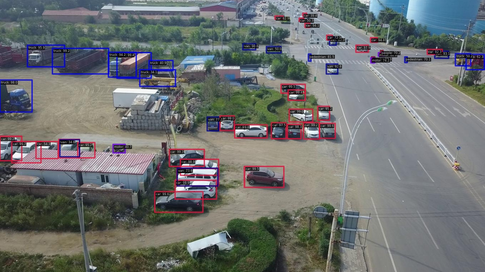
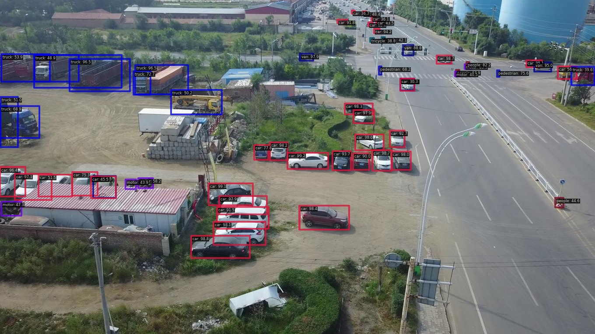
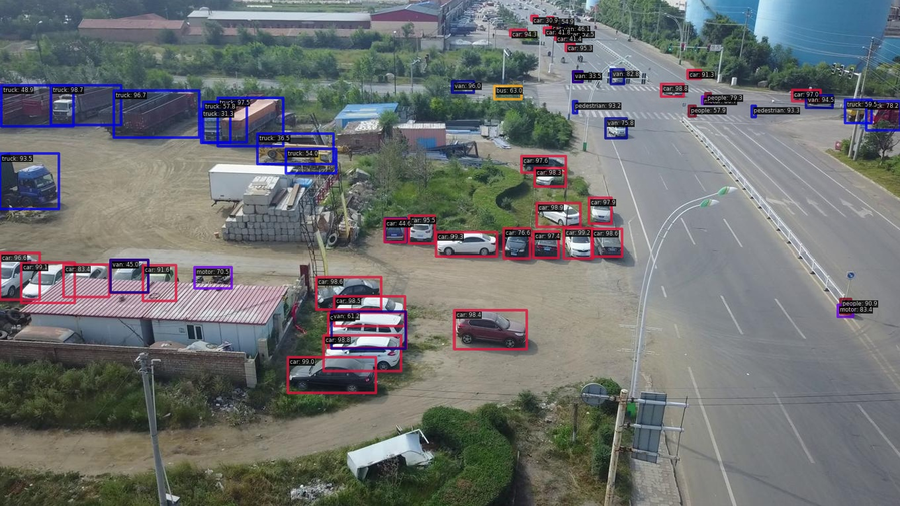
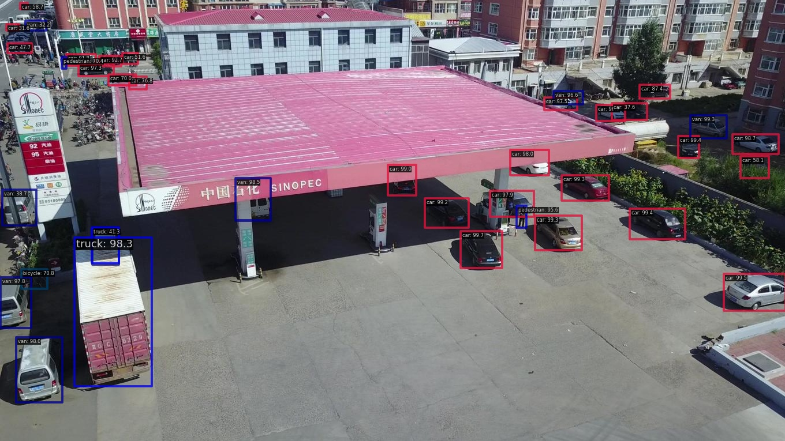
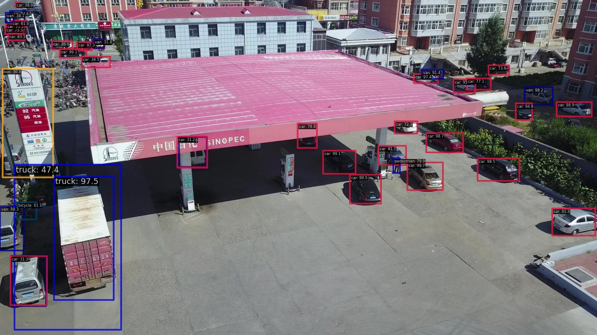
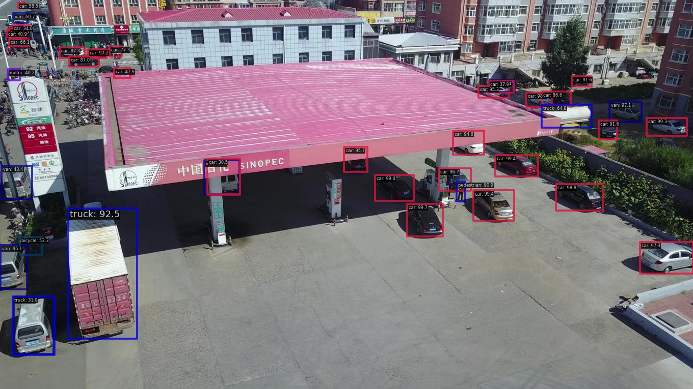
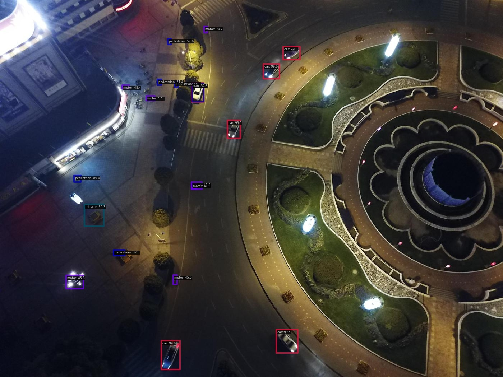
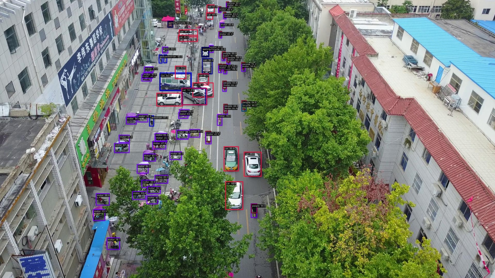
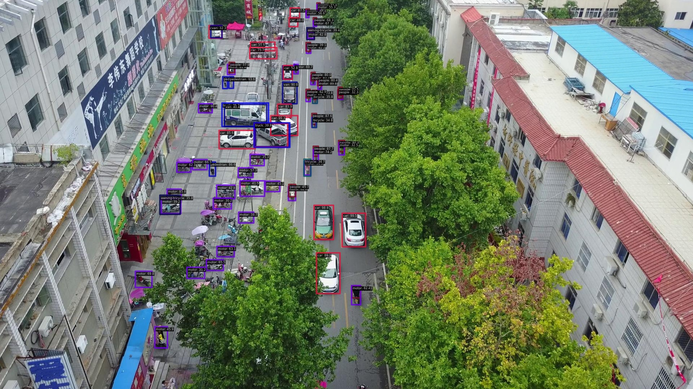

# VisDrone 无人机航拍目标检测实验报告

## 一、项目概述

本项目基于 **MMDetection 3.3.0** 框架，使用 **Faster R-CNN** 作为基础检测模型，在 **VisDrone** 无人机航拍数据集上进行目标检测任务。共进行了三组对比实验，探索不同 backbone、预训练策略、数据增强方式和训练参数对检测性能的影响。

### 数据集

- **数据集**: VisDrone-DET（无人机航拍图像检测）
- **图像数量**: 8629 张（训练+验证）
- **图像分辨率**: 原始分辨率约 1920×1080（无人机高空拍摄）
- **标注格式**: COCO format
- **类别数**: 10 类

| 类别 | 英文名 |
|------|--------|
| 汽车 | car |
| 行人(远) | people |
| 面包车 | van |
| 卡车 | truck |
| 摩托车 | motor |
| 自行车 | bicycle |
| 三轮车 | tricycle |
| 遮阳三轮车 | awning-tricycle |
| 行人(近) | pedestrian |
| 公交车 | bus |

### 数据集特点与难点

- 无人机高空俯视角度，目标普遍较小
- 密集场景中目标遮挡严重
- 同一场景中目标尺度差异大（近处车辆 vs 远处行人）
- 包含夜间、阴天等多种光照条件

---

## 二、技术路线

### 统一检测框架：Faster R-CNN

所有实验均采用 **Faster R-CNN** 两阶段检测器，核心结构如下：

```
输入图像 → Backbone(特征提取) → FPN(多尺度特征融合) → RPN(候选框生成) → RoI Head(分类+回归)
```

**关键组件配置**（三组实验通用）：

| 组件 | 配置 |
|------|------|
| Neck | FPN, out_channels=256, 5层输出 |
| RPN Anchor | scales=[4,8,16], ratios=[0.5,1.0,2.0], strides=[4,8,16,32,64] |
| RoI Extractor | RoIAlign, output_size=7 |
| BBox Head | Shared2FCBBoxHead, fc_out=1024 |
| NMS | IoU threshold=0.5, max_per_img=300 |
| 优化器 | SGD, momentum=0.9, weight_decay=0.0001 |

---

## 三、实验设计与对比

### 实验一：ResNet50-v1（基线实验）

| 项目 | 配置 |
|------|------|
| Backbone | ResNet-50 (frozen_stages=1) |
| 预训练权重 | torchvision://resnet50（仅 backbone ImageNet 预训练） |
| 输入尺度 | (1333, 640)~(1333, 800) RandomResize |
| 数据增强 | RandomResize + RandomFlip(p=0.5) |
| 学习率 | 0.02 |
| Batch Size | 2 |
| 训练轮数 | 100 epochs |
| 学习率调度 | MultiStepLR, milestones=[70, 90], gamma=0.1 |
| Warmup | LinearLR, 500 iters |

### 实验二：ResNet50-v2（改进实验）

| 项目 | 配置 |
|------|------|
| Backbone | ResNet-50 (frozen_stages=1) |
| 预训练权重 | **COCO 预训练的 Faster R-CNN 全模型权重** |
| 输入尺度 | **(1920, 1080)** 原始分辨率，ratio_range=(0.5, 1.5) |
| 数据增强 | RandomResize + **RandomCrop(800×800)** + RandomFlip + **PhotoMetricDistortion** |
| 学习率 | **0.0025**（降低 8 倍） |
| Batch Size | 2 |
| 训练轮数 | **36 epochs** |
| 学习率调度 | MultiStepLR, milestones=[24, 33], gamma=0.1 |
| Warmup | LinearLR, 1000 iters |

### 实验三：MobileNetV2

| 项目 | 配置 |
|------|------|
| Backbone | **MobileNetV2** (widen_factor=1.0, frozen_stages=-1 全部可训练) |
| 预训练权重 | open-mmlab://mmdet/mobilenet_v2（仅 backbone 预训练） |
| 输入尺度 | (1920, 1080)，ratio_range=(0.5, 1.5) |
| 数据增强 | RandomResize + RandomCrop(800×800) + RandomFlip + PhotoMetricDistortion |
| 学习率 | 0.0025 |
| Batch Size | **4** |
| 训练轮数 | 36 epochs |
| 学习率调度 | MultiStepLR, milestones=[24, 33], gamma=0.1 |
| Warmup | LinearLR, 1000 iters |

### 关键差异总结

| 改进点 | v1 → v2/MobileNetV2 的变化 | 影响 |
|--------|---------------------------|------|
| 预训练策略 | 仅 backbone → COCO 全模型微调(v2) | 检测头有更好的初始化，收敛更快 |
| 输入分辨率 | 1333×800 → 1920×1080 | 保留更多小目标细节 |
| 数据增强 | 简单增强 → RandomCrop+光照扰动 | 提升模型鲁棒性和泛化能力 |
| 学习率 | 0.02 → 0.0025 | 微调场景下避免破坏预训练特征 |
| 训练轮数 | 100 → 36 | 配合更好的初始化，36轮即可收敛 |

---

## 四、实验结果

### 4.1 精度对比

| 模型 | Best Epoch | mAP | mAP_50 | mAP_75 | mAP_s | mAP_m | mAP_l |
|------|-----------|-----|--------|--------|-------|-------|-------|
| ResNet50-v1 | 85 | 0.109 | 0.154 | 0.126 | 0.072 | 0.131 | 0.168 |
| MobileNetV2 | 30 | 0.244 | 0.419 | 0.251 | 0.168 | 0.342 | 0.361 |
| **ResNet50-v2** | **30** | **0.313** | **0.506** | **0.281** | **0.221** | **0.436** | **0.493** |

### 4.2 速度对比

| 模型 | 参数量级 | 平均推理时间 | FPN in_channels |
|------|---------|-------------|-----------------|
| ResNet50-v1 | ~41M | **35.3 ms** | [256, 512, 1024, 2048] |
| MobileNetV2 | ~8M | 35.2 ms | [24, 32, 96, 1280] |
| ResNet50-v2 | ~41M | 49.5 ms | [256, 512, 1024, 2048] |

> 注：ResNet50-v2 推理较慢是因为测试输入分辨率为 1920×1080（v1 为 1333×800）。

### 4.3 训练收敛曲线

**ResNet50-v1**（100 epochs，收敛极慢且精度饱和在 0.109）:
```
epoch 20: 0.103 → epoch 40: 0.108 → epoch 60: 0.108 → epoch 85: 0.109 → epoch 100: 0.108
```

**MobileNetV2**（36 epochs，快速收敛）:
```
epoch 3: 0.127 → epoch 12: 0.199 → epoch 24: 0.226 → epoch 30: 0.244 → epoch 36: 0.243
```

**ResNet50-v2**（36 epochs，收敛最快、精度最高）:
```
epoch 3: 0.215 → epoch 12: 0.262 → epoch 24: 0.281 → epoch 30: 0.313 → epoch 36: 0.312
```

---

## 五、推理可视化

以下展示三个模型在不同场景下的检测效果（置信度阈值 0.3）。

### 场景1：城镇道路（日间，多种车辆混合）

**ResNet50-v1** — 53 个检测框


**MobileNetV2** — 60 个检测框


**ResNet50-v2** — 64 个检测框


> 分析：v2 对远处密集车辆和行人的检测更完整，v1 存在明显漏检。MobileNetV2 表现居中。

---

### 场景2：加油站区域（中等密度，多类别）

**ResNet50-v1** — 38 个检测框


**MobileNetV2** — 40 个检测框


**ResNet50-v2** — 40 个检测框


> 分析：三个模型在中等目标上表现接近。v2 对远处小目标（道路上的车辆）识别更准确，类别置信度也更高。

---

### 场景3：夜间广场（低光照，稀疏目标）

**ResNet50-v1** — 20 个检测框


**MobileNetV2** — 14 个检测框


**ResNet50-v2** — 18 个检测框


> 分析：夜间场景下 v1 误检较多（将路灯等误检为目标），v2 检测更精准。MobileNetV2 较保守，漏检更多但误检也少。

---

### 场景4：密集街道（高密度，小目标为主）

**ResNet50-v1** — 80 个检测框


**MobileNetV2** — 78 个检测框


**ResNet50-v2** — 81 个检测框


> 分析：密集小目标场景下，三个模型检测数量相近，但 v1 的 mAP_s 仅 0.072，说明其虽然检出了框，但定位和分类质量较差。

---

## 六、结论与分析

### 6.1 核心发现

1. **COCO 预训练全模型微调是最关键的提升因素**
   - ResNet50-v1（仅 backbone 预训练）: mAP = 0.109
   - ResNet50-v2（COCO 全模型微调）: mAP = 0.313（**提升 187%**）
   - 检测头（RPN + RoI Head）从 COCO 学到的通用检测能力可以很好地迁移到 VisDrone

2. **高分辨率输入对小目标检测至关重要**
   - v1 使用 1333×800 输入，mAP_s = 0.072
   - v2 使用 1920×1080 输入，mAP_s = 0.221（**提升 207%**）
   - 无人机场景目标本身就小，缩小分辨率会导致信息严重丢失

3. **数据增强策略的贡献**
   - RandomCrop(800×800): 训练时裁剪局部区域，模拟不同尺度，增强小目标学习
   - PhotoMetricDistortion: 光照/色彩扰动，提升夜间等复杂光照场景的鲁棒性

4. **轻量级 backbone 的精度-速度权衡**
   - MobileNetV2 参数量仅 ResNet50 的 1/5，推理速度相当
   - 但精度差距明显（0.244 vs 0.313），主要受限于 backbone 表征能力和缺少 COCO 全模型预训练

### 6.2 ResNet50-v1 失败原因分析

v1 实验 mAP 仅 0.109，训练 100 个 epoch 也未能有效提升，主要原因：
- **仅预训练 backbone**，RPN 和检测头从随机初始化开始训练，在小数据集上难以充分学习
- **学习率过高**（0.02），不适合精细任务的微调
- **输入分辨率偏低**（1333×800），丢失了大量小目标信息
- **数据增强不足**，缺少 RandomCrop 和颜色增强

### 6.3 最佳模型：ResNet50-v2

| 指标 | 值 |
|------|-----|
| mAP | 0.313 |
| mAP_50 | 0.506 |
| mAP_75 | 0.281 |
| 小目标 mAP_s | 0.221 |
| 中目标 mAP_m | 0.436 |
| 大目标 mAP_l | 0.493 |
| 推理速度 | ~50ms/帧 (~20 FPS) |

---

## 七、后续优化方向

1. **更强的 Backbone**: 替换为 Swin Transformer 或 ConvNeXt，提升特征表达能力
2. **多尺度训练/测试**: TTA（Test Time Augmentation）可进一步提升 mAP
3. **更先进的检测头**: 尝试 Cascade R-CNN 或 DINO 等端到端检测器
4. **针对小目标优化**: 使用 PAFPN 或增加更高分辨率的 FPN 层级
5. **数据层面**: 引入 Mosaic/MixUp 增强，或使用切图（sliced inference）策略处理超大分辨率图像

---

*报告生成时间: 2026-03-05*
*框架: MMDetection 3.3.0 + MMEngine + MMCV 2.1.0*
*硬件: CUDA GPU*
